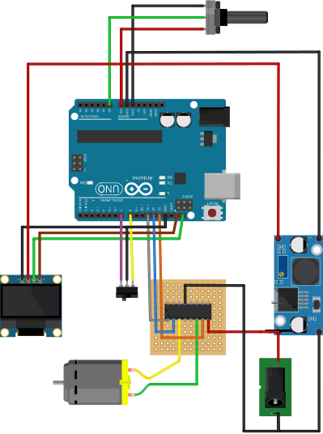
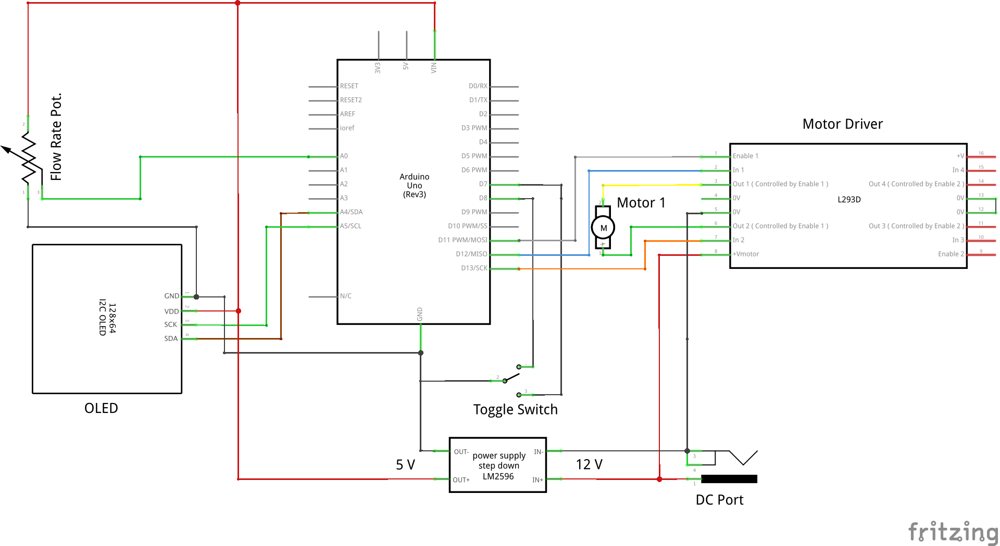
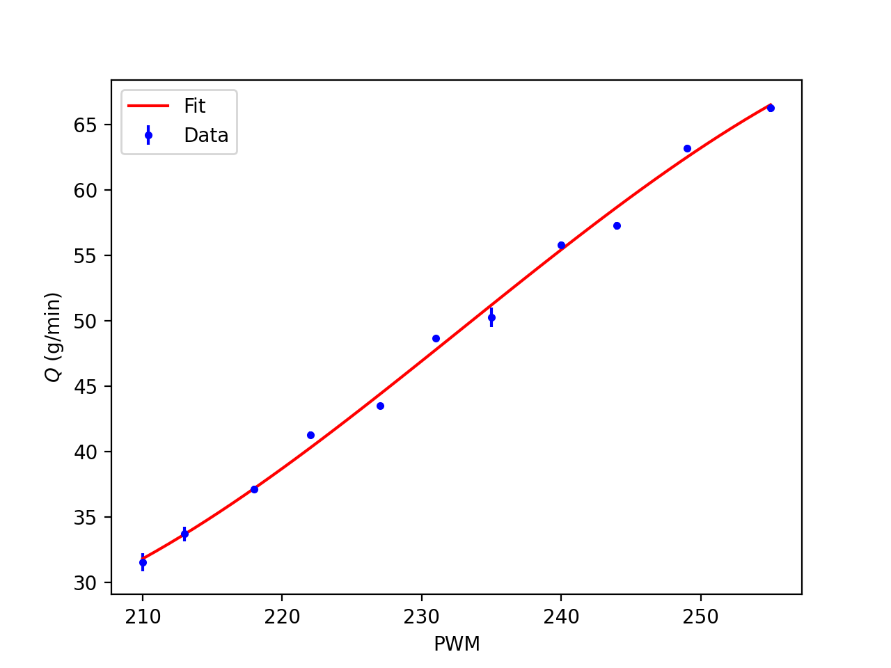

# peristaltic-pump

Arduino code and electronics design for a simple peristaltic pump.

- Use a toggle switch to change between off, forward, and reverse flow
- A potentiometer to vary the rotation rate of the DC motor.
- Output the rotation direction and rotation rate as calibrated flow rate on a 128x64 OLED
- Can control two pumps simultaneously

## Getting Started

1. Wire all elements as shown in the diagram.
2. Ensure you have a recent version of the Adafruit SSD1306 library.
3. Use [I2C scanner](https://playground.arduino.cc/Main/I2cScanner/) to detect
the I2C address of your OLED (e.g. `0x3C`), and input it into the following line:
`display.begin(SSD1306_SWITCHCAPVCC, 0x3C);`
4. Compile and upload the program to your Arduino compatible board

> :warning: **WARNING: If you are using an old Adafruit library (before Nov. 2018)**:
> Find Adafruit_SSD1306.h under the Arduino libraries:
>
> `PATH_TO_ARDUINO_INSTALLATION/libraries/Adafruit_SSD1306/`
>
> Look for  `SSD1306 Displays` and uncomment one define to match your display:
>
> e.g. uncomment only `#define SSD1306_128_64` if using a 128x64 OLED
> That section of the file should look like:
>
>  ``` c
>/*=========================================================================
>    SSD1306 Displays
>    -----------------------------------------------------------------------
>    The driver is used in multiple displays (128x64, 128x32, etc.).
>    Select the appropriate display below to create an appropriately
>    sized framebuffer, etc.
>
>    SSD1306_128_64  128x64 pixel display
>
>    SSD1306_128_32  128x32 pixel display
>
>    SSD1306_96_16
>
>    -----------------------------------------------------------------------*/
>     #define SSD1306_128_64
>//   #define SSD1306_128_32
>//   #define SSD1306_96_16
>/*=========================================================================*/
> ```
>
> Additionally, in `pump_control.ino` you might need to comment out the following
> line:
>
> `Adafruit_SSD1306 display(SCREEN_WIDTH, SCREEN_HEIGHT, &Wire, OLED_RESET);`

## Needed Material

1. Arduino compatible board (Uno rev. 3 used for this example)
2. LM2596 DC-DC step down module
3. 12 V power adapter
4. DC barrel socket power jack
5. OLED 128x64 I2C Monochrome Display
6. Low powered peristaltic pump using 12 V DC motor
7. L293D H-Bridge motor driver
8. Rotary Potentiometer (e.g. 10 kΩ)
9. Single Pull Single Throw Toggle Switch (On-Off-On)

## Wiring Guide





### Powering the Device

Assuming a 12 V DC adapter is used to power everything, it is convenient to place
a DC socket as the entry point to the device.
This be wired in two directions, the 12 V core to pin 8 of the L293D motor driver,
and to the high input of an LM2596 DC-DC step down converter. Similarly, the
ground can be connected to pin 3 of the L293D and the low input of the LM2596.
Adjust the DC-DC converter to produce 5 V across the output pins, which will be used
to drive the Arduino and OLED.

### Powering the Motor

We use control the motor in full H-bridge mode to be able to reverse the rotation
direction. Do this by connecting the following pins on the L293D motor driver:

| L293D              | Arduino/DC Jack     |
| ------------------ | ------------------- |
| Pin 1 (Enable)     | D11 PWM             |
| Pin 2 (In 1)       | D12                 |
| Pin 3 (Out 1)      | Motor pin 2         |
| Pin 4 (0 V )       | --                  |
| Pin 5 (0 V)        | Ground from DC Jack |
| Pin 6 (Out 2)      | Motor pin 1         |
| Pin 7 (In 2)       | D13                 |
| Pin 8 (+Vmotor)    | 12 V from DC Jack   |
| Pin 12 or 13 (0 V) | Ground from DC Jack |

Pins 2 and 7 determine the rotation state of the motor:

| Pin 2 | Pin 7 | Motor   |
| ----- | ----- | ------- |
| High  | Low   | Forward |
| Low   | High  | Reverse |
| High  | High  | Brake   |
| Low   | Low   | Brake   |

Pin 1 (Enable) is used to turn the motor, and regardless of pins 2 and 7, if Pin 1
(Enable) is low, then the motor will not rotate. Changing the rotation rate of the
motor is done using a PWM signal into Pin 1. This is sent as a duty cycle (% of
time on versus total time) as an int from 0 to 255 where 0%, i.e.  no pulses, and 255
means 100%, i.e. constant HIGH.

The function used to rotate the motor forward:

``` c
// Drives the motor forward at duty cycle 'duty_cycle'
void motor_forward(byte duty_cycle)
{
  display.println("Forward");
  digitalWrite(in1, HIGH);
  digitalWrite(in2, LOW);
  analogWrite(enable_motor_A, duty_cycle);
}
```

### Toggle Switch

The motor can be in one of three states, stopped, rotating forward, rotating reverse

Pins 7 and 8 are used for detecting the direction of a toggle switch (SPDT On-Off-On).
The two `On` poles of the switch are connected to pins 7 & 8, and the central pole
is connected to ground.

``` c
// Switch pins
const byte fwd_pin = 7; // Forward
const byte rev_pin = 8; // Reverse
```

We make sure the pins' internal pullup resistors are enabled to drive them to HIGH

```c
// Pins for Detecting Forward or Reverse
pinMode(fwd_pin, INPUT_PULLUP);
pinMode(rev_pin, INPUT_PULLUP);
```

Then whenever the toggle switch is enabled, this will ground one of the pins to LOW.
We detect the pin state with the following function, and then rotate or stop the
motor.

``` c
// Logic to check motor switch state
void motor_check()
{
  display.setCursor(0, 40);

  if (digitalRead(fwd_pin) == LOW)
  {
    motor_forward(duty_cycle);
  }
  else if (digitalRead(rev_pin) == LOW)
  {
    motor_reverse(duty_cycle);
  }
  else
  {
    motor_stop();
  }
}
```

### Flow Rate

The flow rate is set by reading the potential at pin `A0`,

`pot_value = analogRead(pot_read_pin);`

and mapping this to a value between 210-255. Lower than 210 stalls my motor

`duty_cycle = map(pot_value, 0, 1023, 210, 255);`

and for display on the OLED, the duty cycle is converted to flow rate calibrated
for this pump

```c
flow_rate = conv_flow_rate(duty_cycle);
```

The calibration was done using a third order polynomial, a balance between acurracy
and speed

```c
// Convert PWM values to flow rate. Only valid for forward flow, not reverse.
float conv_flow_rate(byte duty_cycle)
{
  // const float slope = 0.8073;
  // const float offset = -138.688;
  // float flow_rate = duty_cycle * slope + offset;

  // Third order polynomial.
  // Table lookup would be more efficient, but not needed
  const float a = -1.70373460e-04;
  const float b = 1.19023534e-01;
  const float c = -2.68600744e+01;
  const float d = 2.00133906e+03;
  float flow_rate = a * duty_cycle * duty_cycle * duty_cycle + b * duty_cycle * duty_cycle + c * duty_cycle + d;
  return flow_rate;
}
```


